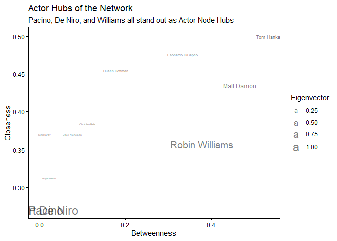

# DACSS690C Homework 2
Patrick McGrath

## Objective

The goal of this assignment is to examine the social network of
Hollywood Actors.

## Data

Data was downloaded from the provided link and then re-uploaded to
dedicated Github for this assignment

``` r
dataGitLink='https://github.com/DACSS690C26/Homework_2/raw/main/hollywood.graphml'
actors=read_graph(dataGitLink,format='graphml')
#summary(actors)
```

The file includes data on 11 actors, all men, with the majority having
won oscars in the past.

``` r
#plotting the base network while distinguishing Oscar winners
base=ggraph(graph = actors, layout = "stress")
base + geom_node_label(aes(label = name,
                           color=as.factor(wonOscar)),
                       repel = TRUE,show.legend = F) + 
  geom_edge_link(alpha=0.1) + 
  scale_color_manual(values = c('red','blue')) +
  labs(title = "Social Network of Hollywood Actors")
```


``` r
#blue = yes, red = no
```

### Calculate Centrality Measures

Measures of centrality were calculated, including eigen centrality,
closeness, and betweenness. These values were then used to determine the
hubs of the network, namely Pacino, De Niro, and Williams.

``` r
eigen=eigen_centrality (actors)$vector


close = closeness(actors, normalized = TRUE)

betw <- betweenness(actors, normalized = TRUE)

DFCentrality=as.data.frame(cbind(eigen,close,betw),stringsAsFactors = F)
names(DFCentrality)=c('Eigenvector','Closeness','Betweenness')

DFCentrality$person=row.names(DFCentrality)
row.names(DFCentrality)=NULL

## see
head(DFCentrality)
```

      Eigenvector Closeness Betweenness            person
    1  0.60670504 0.3571429  0.37777778    Robin Williams
    2  0.01469953 0.3703704  0.01111111         Tom Hardy
    3  0.03468977 0.4545455  0.17777778    Dustin Hoffman
    4  0.03714365 0.4761905  0.33333333 Leonardo DiCaprio
    5  0.07209892 0.5000000  0.53333333         Tom Hanks
    6  1.00000000 0.2702703  0.00000000         Al Pacino

``` r
#plot closeness by betweenness with Eigenvector denoting size

ggplot(DFCentrality, aes(x=Betweenness, y=Closeness)) + 
  theme_classic() +
  geom_text(aes(label=person,size=Eigenvector),show.legend = T,alpha=0.5) +
  labs(title = "Actor Hubs of the Network",
       subtitle = "Pacino, De Niro, and Williams all stand out as Actor Node Hubs")
```



In looking at the Hub nodes, we can see they are all located in a
specific region of the network.

``` r
HubNodes=dplyr::slice_max(DFCentrality, order_by = Eigenvector, n = 3)$person
#HubNodes


NodeCount=length(V(actors))

V(actors)$label=''

for (index in seq(1:NodeCount)){
  currentName=V(actors)$name[index]
  if (currentName%in%HubNodes){
    V(actors)$label[index]=currentName
  }
}


base=ggraph(graph = actors, layout = "stress")
base  + geom_node_label(aes(label = label), 
                        repel = TRUE,
                        show.legend = F,
                        color='black') + 
  geom_edge_link(alpha=0.1) + 
  geom_node_point()
```


### Test for presence of Communities

To test for the presence of communities within the network, we calculate
the Ratio between the Actors transitivity and an ensemble of random
networks. We found a ratio of 1.90, which being greater than 1,
indicates that a community likely exists, warranting further
examination.

``` r
# Generate an ensemble of 1000 rewired random networks 
set.seed(123)
replicates <- 1000  
random_transitivities <- replicate(replicates, {
  RandomNet <- rewire(actors, 
                      keeping_degseq(niter = gsize(actors) * 10))
  transitivity(RandomNet, type = "global")
})
mean_random_transitivities=mean(random_transitivities)

# Calculate your empirical transitivity
empirical_transitivity <- transitivity(actors, type = "global")

### Report
report_table <- data.frame(
  Metric = c("Actors transitivity", "Random-network mean", "Ratio"),
  Value  = round(c(empirical_transitivity,
                   mean_random_transitivities,
                   empirical_transitivity / mean_random_transitivities), 4)
)
knitr::kable(report_table)
```

| Metric              |  Value |
|:--------------------|-------:|
| Actors transitivity | 0.2500 |
| Random-network mean | 0.1310 |
| Ratio               | 1.9084 |

### Analyze Possible Communities Via Various Algorithms

We tested the presence of communities within the social network via
Louvain, Walk trap, Fast Greedy, Infomap, and Edge Betweenness, looking
for the best algorithm.

``` r
# Run all five community-detection algorithms
algos <- list(
  louvain          =  { set.seed(123); cluster_louvain(actors) },
   walktrap         = cluster_walktrap(actors),
   fast_greedy      = cluster_fast_greedy(actors),
   infomap          = cluster_infomap(actors),
  edge_betweenness = cluster_edge_betweenness(actors)
)
```

    Warning in cluster_edge_betweenness(actors): Membership vector will be selected based on the highest modularity score.
    Source: community/edge_betweenness.c:503

``` r
# Build a summary table: number of clusters, modularity (Q), and cluster sizes
summary_table <- data.frame(
  algorithm   = names(algos),
  n_clusters  = sapply(algos, length),
  modularity_Q  = sapply(algos, modularity),
  cluster_sizes = sapply(algos, function(cl) {
    paste(sort(sizes(cl), decreasing = TRUE), collapse = ", ")
  })
)

# Sort by modularity, descending, so the "best" partition (by this metric) is on top
summary_table <- summary_table[order(-summary_table$modularity_Q), ]
rownames(summary_table) <- NULL

print(summary_table)
```

             algorithm n_clusters modularity_Q cluster_sizes
    1         walktrap          3    0.4199219       6, 3, 2
    2          infomap          2    0.4199219          7, 4
    3 edge_betweenness          2    0.4199219          7, 4
    4          louvain          3    0.4121094       4, 4, 3
    5      fast_greedy          3    0.4121094       4, 4, 3

Through examining the results of the various algorithms, we can see that
they are relatively similar in modularity, with Walktrap, Infomap, and
Edge Betweenness resulting in modularities of approximately 0.420, while
Louvain and Fast Greedy resulted in modularity scores of 0.412. Both
sets of modularity scores are moderate and indicative of string
partitioning. The numbers of clusters present were found to be either 2
or 3, with Walktrap, Louvain, and Fast Greedy resulting in 3 clusters
while Infomap and Betweenness resulted in 2. Cluster sizes were similar
across algorithms with equal cluster sizes.

For our purposes, we can say that the Walktrap algorithm was the best
method.

``` r
for (name in names(algos)) {
  memb <- membership(algos[[name]])
  attr_name <- name
  actors <- set_vertex_attr(actors, attr_name,
                            index = names(memb),
                            # this is important for exporting
                            value = as.vector(memb))
}


#walktrap
base=ggraph(graph = actors, layout = "stress") +
  geom_edge_link(alpha=0.2)

base + geom_node_point(aes(color=as.factor(walktrap)), 
                       show.legend = T, size=4)+
  geom_node_text(aes(label = name), 
                 repel = TRUE, 
                 max.overlaps = 50, # avoid overlap
                 size = 2.5) +
  labs(title = "WalkTrap Algo Plot",
       subtitle = "Three Communities can be identified via the Walktrap Algorithm")
```


Looking at the final graph of the network, we can see the WalkTrap
algorithm highlighted three distinct communities. The largest being
comprised of 6 nodes, with the others being comprised of 2 nodes and 3
nodes, respectively.

``` r
null_mean <- mean(random_transitivities)
null_sd   <- sd(random_transitivities)
z_score   <- (empirical_transitivity - null_mean) / null_sd
count_exceeding <- sum(random_transitivities >= empirical_transitivity)
p_value <- count_exceeding / replicates
test_table <- data.frame(
  Alpha    = c(0.05, 0.01),
  Z_score  = round(z_score, 3),
  P_value  = sprintf("%.3f (%d/%d)", p_value, count_exceeding, replicates),
  Decision = c(if (p_value < 0.05) "SIGNIFICANT" else "NOT significant",
               if (p_value < 0.01) "SIGNIFICANT" else "NOT significant")
)
knitr::kable(test_table)
```

| Alpha | Z_score | P_value          | Decision        |
|------:|--------:|:-----------------|:----------------|
|  0.05 |   1.097 | 0.278 (278/1000) | NOT significant |
|  0.01 |   1.097 | 0.278 (278/1000) | NOT significant |

The transitivity test came back non-significant with a p-value of 0.278,
far above either threshold. This indicates that the analysis does not
support the existence of a true community structure based on the data
provided.
