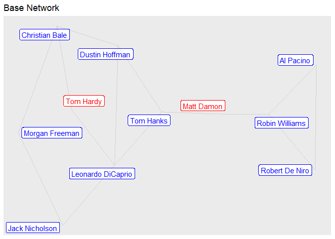
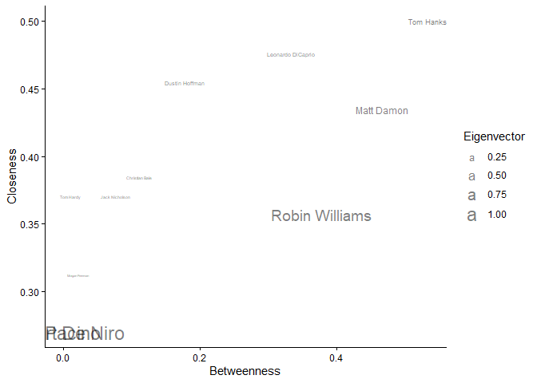
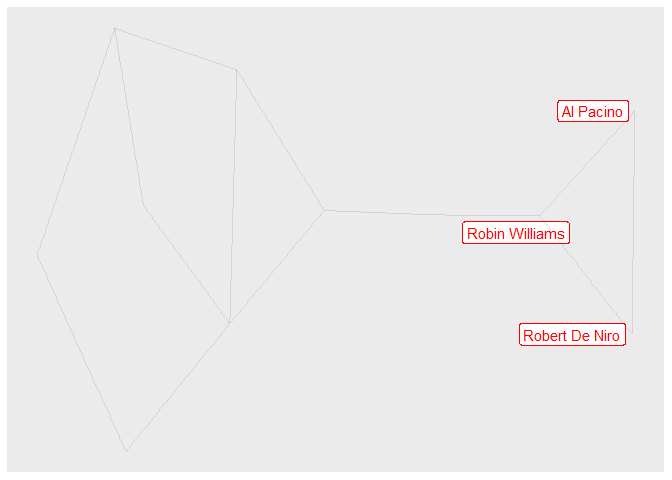
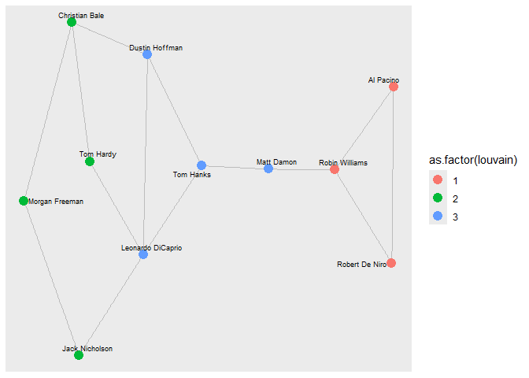
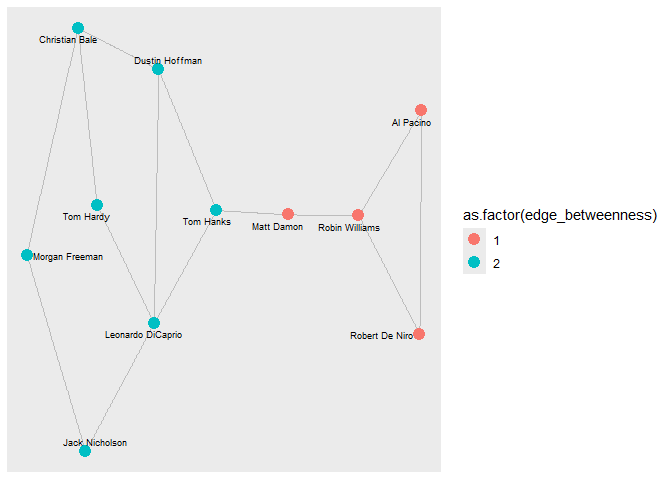
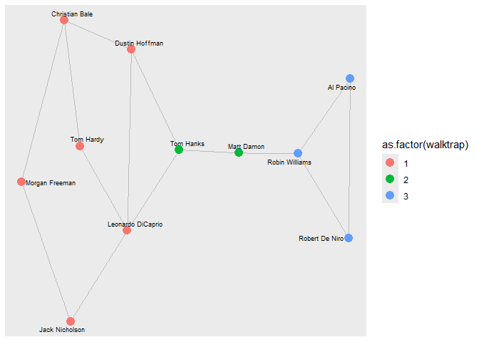
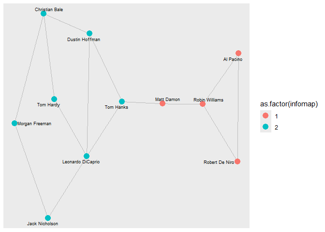
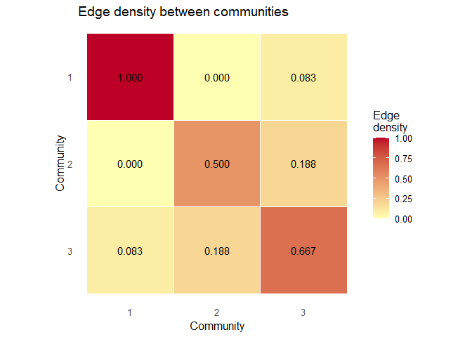
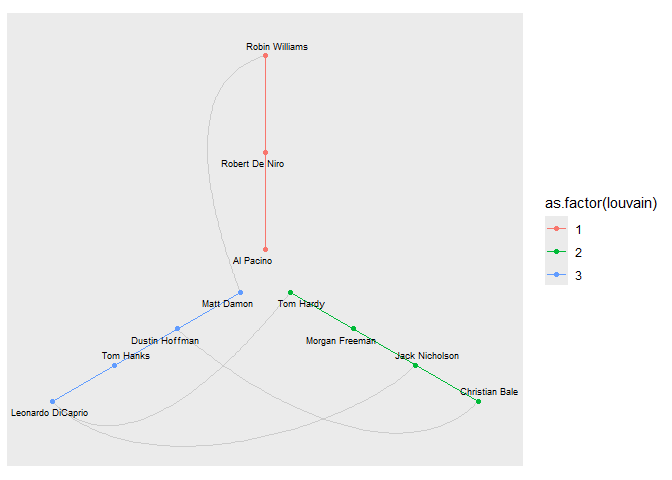

# DACSS690C Homework 2
Patrick McGrath

## Objective

The goal of this assignment is to examine the social network of
Hollywood Actors.

## Data

Data was downloaded from the provided link and then re-uploaded to
dedicated Github for this assignment

    IGRAPH 2be31ce UNW- 11 14 -- 
    + attr: wonOscar (v/n), color (v/c), name (v/c), id (v/c), weight (e/n)

``` r
base=ggraph(graph = actors)
```

    Using "stress" as default layout

``` r
base + geom_node_label(aes(label = name,
                           color=as.factor(wonOscar)),
                       repel = TRUE,show.legend = F) + 
  geom_edge_link(alpha=0.1) + 
  scale_color_manual(values = c('red','blue')) +
  labs(title = "Base Network")
```



``` r
#blue = yes, red = no
```

``` r
eigen=eigen_centrality (actors)$vector
print(eigen)#influence of node in network
```

       Robin Williams         Tom Hardy    Dustin Hoffman Leonardo DiCaprio 
          0.606705039       0.014699527       0.034689773       0.037143649 
            Tom Hanks         Al Pacino    Morgan Freeman    Robert De Niro 
          0.072098921       1.000000000       0.007860685       1.000000000 
           Matt Damon    Jack Nicholson    Christian Bale 
          0.188206119       0.012477963       0.015873210 

``` r
close = closeness(actors, normalized = TRUE)
close
```

       Robin Williams         Tom Hardy    Dustin Hoffman Leonardo DiCaprio 
            0.3571429         0.3703704         0.4545455         0.4761905 
            Tom Hanks         Al Pacino    Morgan Freeman    Robert De Niro 
            0.5000000         0.2702703         0.3125000         0.2702703 
           Matt Damon    Jack Nicholson    Christian Bale 
            0.4347826         0.3703704         0.3846154 

``` r
betw <- betweenness(actors, normalized = TRUE)
betw
```

       Robin Williams         Tom Hardy    Dustin Hoffman Leonardo DiCaprio 
           0.37777778        0.01111111        0.17777778        0.33333333 
            Tom Hanks         Al Pacino    Morgan Freeman    Robert De Niro 
           0.53333333        0.00000000        0.02222222        0.00000000 
           Matt Damon    Jack Nicholson    Christian Bale 
           0.46666667        0.07777778        0.11111111 

``` r
DFCentrality=as.data.frame(cbind(eigen,close,betw),stringsAsFactors = F)
names(DFCentrality)=c('Eigenvector','Closeness','Betweenness')

DFCentrality$person=row.names(DFCentrality)
row.names(DFCentrality)=NULL

## see
head(DFCentrality)
```

      Eigenvector Closeness Betweenness            person
    1  0.60670504 0.3571429  0.37777778    Robin Williams
    2  0.01469953 0.3703704  0.01111111         Tom Hardy
    3  0.03468977 0.4545455  0.17777778    Dustin Hoffman
    4  0.03714365 0.4761905  0.33333333 Leonardo DiCaprio
    5  0.07209892 0.5000000  0.53333333         Tom Hanks
    6  1.00000000 0.2702703  0.00000000         Al Pacino

``` r
ggplot(DFCentrality, aes(x=Betweenness, y=Closeness)) + 
  theme_classic() +
  geom_text(aes(label=person,size=Eigenvector),show.legend = T,alpha=0.5) 
```



``` r
HubNodes=dplyr::slice_max(DFCentrality, order_by = Eigenvector, n = 3)$person
HubNodes
```

    [1] "Al Pacino"      "Robert De Niro" "Robin Williams"

``` r
NodeCount=length(V(actors))

V(actors)$label=''

for (index in seq(1:NodeCount)){
  currentName=V(actors)$name[index]
  if (currentName%in%HubNodes){
    V(actors)$label[index]=currentName
  }
}


base=ggraph(graph = actors)
```

    Using "stress" as default layout

``` r
base  + geom_node_label(aes(label = label), 
                        repel = TRUE,
                        show.legend = F,
                        color='red') + 
  geom_edge_link(alpha=0.1)
```



Communities?

``` r
# Generate an ensemble of 1000 rewired random networks 
set.seed(123)
replicates <- 1000  
random_transitivities <- replicate(replicates, {
  RandomNet <- rewire(actors, 
                      keeping_degseq(niter = gsize(actors) * 10))
  transitivity(RandomNet, type = "global")
})
mean_random_transitivities=mean(random_transitivities)
```

``` r
# Calculate your empirical transitivity
empirical_transitivity <- transitivity(actors, type = "global")
```

``` r
### Report
report_table <- data.frame(
  Metric = c("Actors transitivity", "Random-network mean", "Ratio"),
  Value  = round(c(empirical_transitivity,
                   mean_random_transitivities,
                   empirical_transitivity / mean_random_transitivities), 4)
)
knitr::kable(report_table)
```

| Metric              |  Value |
|:--------------------|-------:|
| Actors transitivity | 0.2500 |
| Random-network mean | 0.1310 |
| Ratio               | 1.9084 |

``` r
# Run all five community-detection algorithms
algos <- list(
  louvain          =  { set.seed(123); cluster_louvain(actors) },
   walktrap         = cluster_walktrap(actors),
   fast_greedy      = cluster_fast_greedy(actors),
   infomap          = cluster_infomap(actors),
  edge_betweenness = cluster_edge_betweenness(actors)
)
```

    Warning in cluster_edge_betweenness(actors): Membership vector will be selected based on the highest modularity score.
    Source: community/edge_betweenness.c:503

``` r
# Build a summary table: number of clusters, modularity (Q), and cluster sizes
summary_table <- data.frame(
  algorithm   = names(algos),
  n_clusters  = sapply(algos, length),
  modularity_Q  = sapply(algos, modularity),
  cluster_sizes = sapply(algos, function(cl) {
    paste(sort(sizes(cl), decreasing = TRUE), collapse = ", ")
  })
)

# Sort by modularity, descending, so the "best" partition (by this metric) is on top
summary_table <- summary_table[order(-summary_table$modularity_Q), ]
rownames(summary_table) <- NULL

print(summary_table)
```

             algorithm n_clusters modularity_Q cluster_sizes
    1         walktrap          3    0.4199219       6, 3, 2
    2          infomap          2    0.4199219          7, 4
    3 edge_betweenness          2    0.4199219          7, 4
    4          louvain          3    0.4121094       4, 4, 3
    5      fast_greedy          3    0.4121094       4, 4, 3

``` r
for (name in names(algos)) {
  memb <- membership(algos[[name]])
  attr_name <- name
  actors <- set_vertex_attr(actors, attr_name,
                              index = names(memb),
                              # this is important for exporting
                              value = as.vector(memb))
}
# verify new attributes
vertex_attr_names(actors)
```

     [1] "wonOscar"         "color"            "name"             "id"              
     [5] "label"            "louvain"          "walktrap"         "fast_greedy"     
     [9] "infomap"          "edge_betweenness"

``` r
base=ggraph(graph = actors) +
  geom_edge_link(alpha=0.2)
```

    Using "stress" as default layout

``` r
base + geom_node_point(aes(color=as.factor(louvain)), 
                       show.legend = T, size=4)+
  geom_node_text(aes(label = name), 
                 repel = TRUE, 
                 max.overlaps = 50, # avoid overlap
                 size = 2.5)
```



``` r
#edge betweenness plot?
base=ggraph(graph = actors) +
  geom_edge_link(alpha=0.2)
```

    Using "stress" as default layout

``` r
base + geom_node_point(aes(color=as.factor(edge_betweenness)), 
                       show.legend = T, size=4)+
  geom_node_text(aes(label = name), 
                 repel = TRUE, 
                 max.overlaps = 50, # avoid overlap
                 size = 2.5)
```



``` r
#edge betweenness plot?
base=ggraph(graph = actors) +
  geom_edge_link(alpha=0.2)
```

    Using "stress" as default layout

``` r
base + geom_node_point(aes(color=as.factor(walktrap)), 
                       show.legend = T, size=4)+
  geom_node_text(aes(label = name), 
                 repel = TRUE, 
                 max.overlaps = 50, # avoid overlap
                 size = 2.5)
```



``` r
#edge betweenness plot?
base=ggraph(graph = actors) +
  geom_edge_link(alpha=0.2)
```

    Using "stress" as default layout

``` r
base + geom_node_point(aes(color=as.factor(infomap)), 
                       show.legend = T, size=4)+
  geom_node_text(aes(label = name), 
                 repel = TRUE, 
                 max.overlaps = 50, # avoid overlap
                 size = 2.5)
```



``` r
louvain_result <- algos$louvain
memb <- membership(louvain_result)
num_communities <- length(louvain_result)

# comm_edges[i, j] will hold the density between community i and community j
# (diagonal = internal density, off-diagonal = cross-community density)
comm_edges <- matrix(0, nrow = num_communities, ncol = num_communities)

for (i in 1:num_communities) {
  for (j in 1:num_communities) {
    if (i == j) {
      # Internal density of a community -- edge_density() correctly uses
      # 2*edges / (n*(n-1)), no manual formula needed
      sub <- induced_subgraph(actors, which(memb == i))
      comm_edges[i, j] <- edge_density(sub)
    } else {
      # Cross density: edges crossing between community i and community j,
      # divided by every possible pair between the two groups
      nodes_i <- which(memb == i)
      nodes_j <- which(memb == j)
      el <- as_edgelist(actors, names = FALSE)
      boundary <- sum((el[,1] %in% nodes_i & el[,2] %in% nodes_j) |
                        (el[,1] %in% nodes_j & el[,2] %in% nodes_i))
      possible <- length(nodes_i) * length(nodes_j)
      comm_edges[i, j] <- boundary / possible
    }
  }
}

# Plot the density matrix as a heatmap; diagonal cells are internal density,
# off-diagonal cells show how "leaky" the boundary is between each pair
dimnames(comm_edges) <- list(1:num_communities, 1:num_communities)
df <- melt(comm_edges, varnames = c("Community_i", "Community_j"), value.name = "density")

ggplot(df, aes(x = factor(Community_j), y = factor(Community_i), fill = density)) +
  geom_tile(color = "white") +
  geom_text(aes(label = sprintf("%.3f", density)), size = 4) +
  scale_fill_gradient(low = "#FFFFB2", high = "#BD0026", name = "Edge\ndensity") +
  scale_y_discrete(limits = rev) +
  coord_equal() +
  labs(title = "Edge density between communities", x = "Community", y = "Community") +
  theme_minimal(base_size = 12) +
  theme(panel.grid = element_blank())
```



``` r
V(actors)$degree = degree(actors) # first compute node degree and assign
ggraph(actors, layout = 'hive', 
       axis = louvain,
       sort.by = degree
) +   
  geom_edge_hive(color='grey80') +   
  geom_axis_hive(aes(colour = as.factor(louvain)), 
                 label = F) + 
  geom_node_point(aes(colour = as.factor(louvain))) +
  geom_node_text(aes(label = name), 
                 repel = TRUE, 
                 max.overlaps = 50, # avoid overlap
                 size = 2.5) +
  coord_fixed()
```



``` r
null_mean <- mean(random_transitivities)
null_sd   <- sd(random_transitivities)
z_score   <- (empirical_transitivity - null_mean) / null_sd
count_exceeding <- sum(random_transitivities >= empirical_transitivity)
p_value <- count_exceeding / replicates
test_table <- data.frame(
  Alpha    = c(0.05, 0.01),
  Z_score  = round(z_score, 3),
  P_value  = sprintf("%.3f (%d/%d)", p_value, count_exceeding, replicates),
  Decision = c(if (p_value < 0.05) "SIGNIFICANT" else "NOT significant",
               if (p_value < 0.01) "SIGNIFICANT" else "NOT significant")
)
knitr::kable(test_table)
```

| Alpha | Z_score | P_value          | Decision        |
|------:|--------:|:-----------------|:----------------|
|  0.05 |   1.097 | 0.278 (278/1000) | NOT significant |
|  0.01 |   1.097 | 0.278 (278/1000) | NOT significant |
